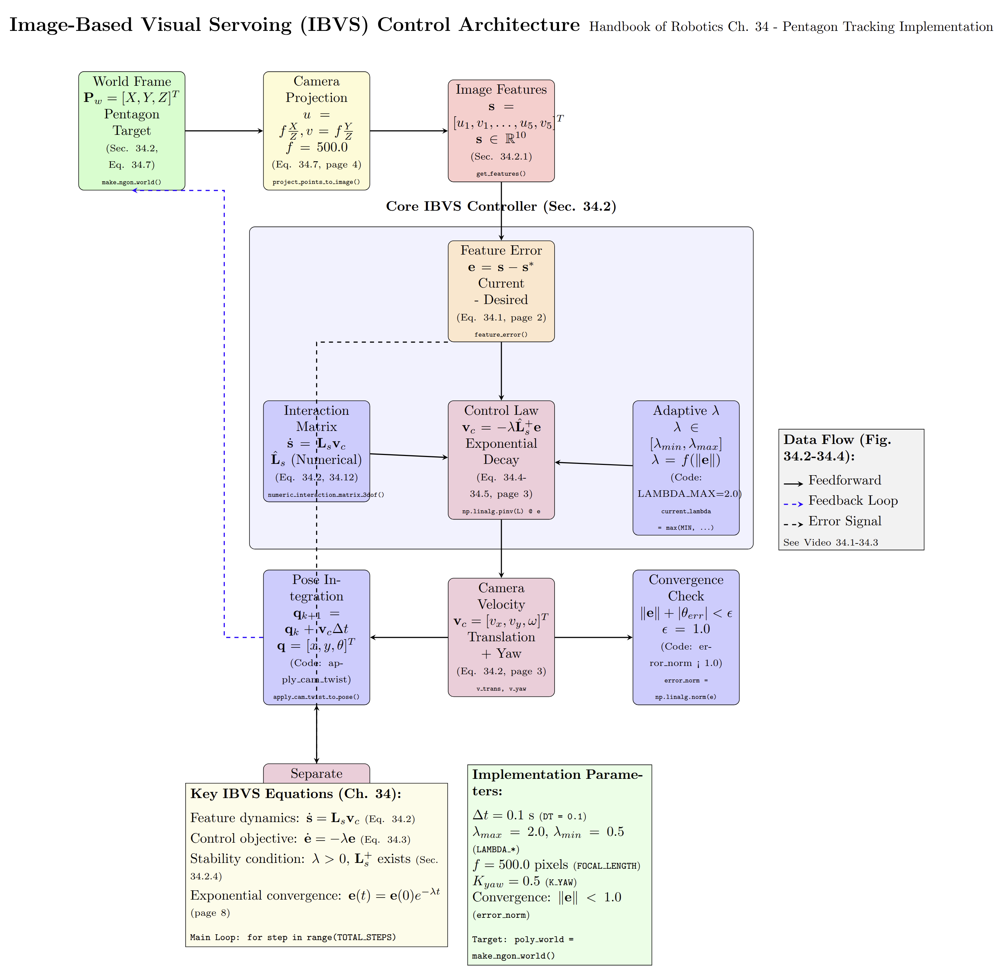
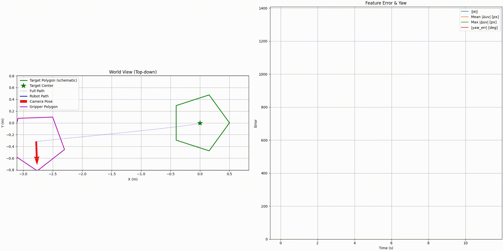

# image_based_visual_servoing_tutorial

This repository demonstrates **Image-Based Visual Servoing (IBVS)** applied to the **peg-in-hole task**.  
The task involves aligning a peg with a target hole under different target shapes:

- **Pentagon hole**: non-circular target with sharp corners  
- **Circular rim hole**: standard round target with elliptical image projection under tilt  

This implementation is based on the methods described in **Chaumette, Hutchinson, and Corke (2016), "Visual Servoing"** in the *Springer Handbook of Robotics*.

---

## Pipeline Visualization

The following pipeline illustrates the overall IBVS control flow for the peg-in-hole task  
(click the image to open the detailed PDF):

---

## Demo Results (GIF Previews)

### Peg-in-Hole with Pentagon Hole
The end-effector is guided to align a peg with a **pentagon-shaped hole**.  

### Peg-in-Hole with Circular Rim
The end-effector aligns the peg with a **circular rim hole**, which appears as an ellipse in the image plane due to perspective projection.  

